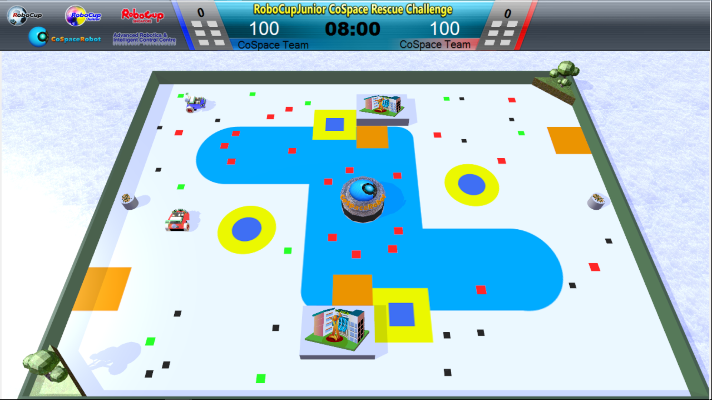

# OPENSKY - Rescue Simulation CSBot
###### Software variants developed between 2014 and 2017 to compete in RoboCupJunior Simulation (AKA CoSpace Rescue), both in Primary and Secondary sub-leagues.

## What is all this?

- The CoSpace Robot Simulator is a virtual real/simulated bridge robotics simulation environment oriented for teaching and challenges, developed by the [Advanced Robotics & Intelligent Control Centre](http://www.robo-erectus.org/) (ARICC) of [Singapore Polytechnic](http://www.sp.edu.sg/).

- CoSpace Rescue Challenge has been introduced as an official RoboCup Junior category in 2010, and it is the only RCJ sub-league to be exclusively focused on software strategy development. You can watch [This Video](https://www.youtube.com/watch?v=DUlGHxyS614) to understand the rules of this team game.

- This repository contains code that I developed in a partnership with both Oswald de Andrade School (from São Paulo) and Santa Bartolomea Capitanio School (from Macapá), inside the platforms own coding environment.

*NOTE:* CS is known for incompatibilities between files and maps. There is *no* guarantee that any of this will work with any versions of it on a post-2017 format.

## Team Description Papers

A few IEEE-format archives detailing universal strategies were developed by the team members for various competition events (written in brazillian Portuguese):

[CHS Controller](http://sistemaolimpo.org/midias/uploads/f8409cfaa5211f89f25c9af680db65f5.pdf) --> 1st Place at the Latin American Robotics Competion 2015, participated in RoboCup World Championship 2016 in Leipzig, Germany

[OpenSky Prime](http://sistemaolimpo.org/midias/uploads/efb6c0975f7a15c687580f62b063180f.pdf) ---> 1st Place at the Latin American Robotics Competition 2016, participated in RoboCup World Championship 2016 in Nagoya, Japan

## How to Play with it?

This software is only supported on machines running Windows.

1. Apply for a serial activation code request: https://www.cospacerobot.org/download/registration
2. Install Microsoft Robotics 4 on your computer: https://www.microsoft.com/en-sg/download/details.aspx?id=29081
3. Now Download the [latest version of CoSpace Rescue Simulator](https://www.cospacerobot.org/download/cospace-rescue-download), extract the zip file and install on top of your MSR4 installation
4. Download or clone this repository to your desktop
5. Launch CSBot and load one of the provided DLL files on one or both robots. Click the play button to run
6. The codes can be inspected, recalibrated and rebuilt directly from inside the program, simply open it´s .smp file and the logic will be displayed 

## Where to Find Me:

* [Telegram Contact 🔵](https://t.me/mekhyw)
* [YouTube Channel 🔴](https://www.youtube.com/channel/UC3__YPhMGjytXUqRUmriQ8A?view_as=subscriber)
* [Twitter Page 🐦](https://twitter.com/MekhyW)
* [Instagram Page 📸](https://www.instagram.com/mekhy_w/)

